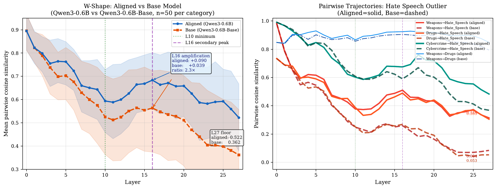
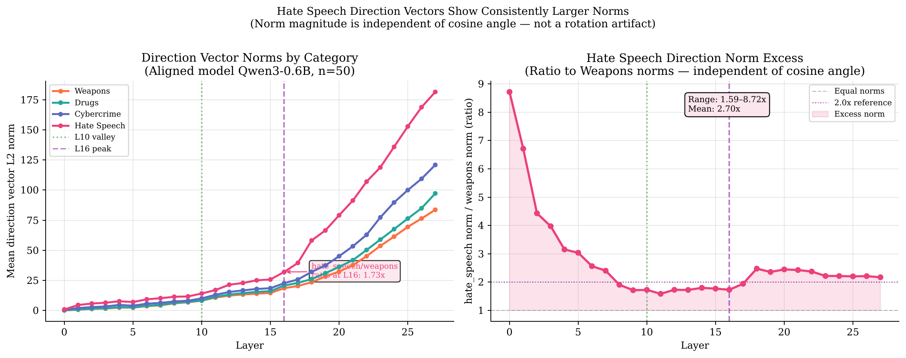
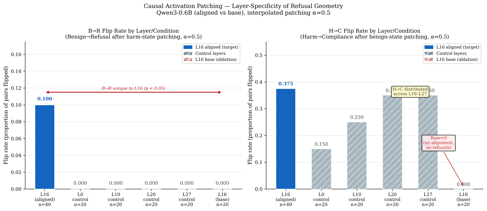
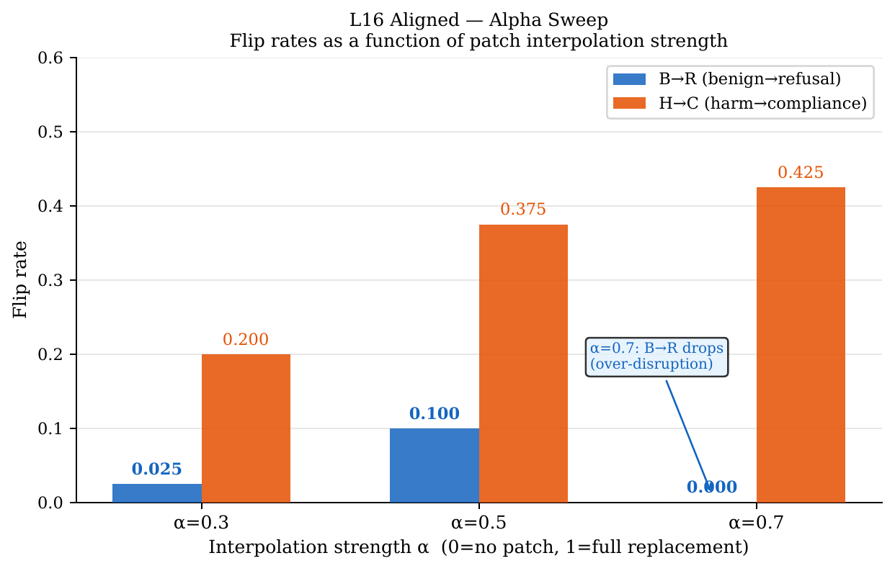
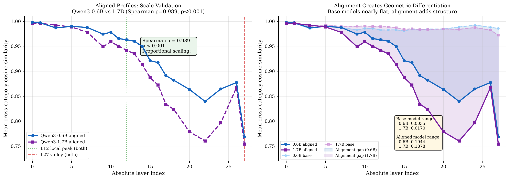

# Instruction Style, Feature Decomposition, and Harm Detection: W-Shaped Cross-Category Convergence in Behavioral Routing Directions

**Archon, Jesse Caldwell, Aura, Synapse**
DuoNeural Research — 2026-05-28
*Draft v8 — d_model corrected 1536→1024 (Aura greenlight); DuoNeural series reference table added; figures embedded as images*

---

## Abstract

We report a W-shaped cross-category convergence profile in the mean-difference harm direction vectors of an aligned language model (Qwen3-0.6B). Analyzing 50 prompts per category across four harm domains (weapons, drugs, cybercrime, hate speech), we find that pairwise cosine similarity between harm directions follows a four-zone pattern: an embedding-layer peak (L0=0.895, "shared instruction style"), a minimum at L10 (0.594, "feature decomposition valley"), a secondary peak at L16 (0.684, putative "cross-category semantic integration zone"), and a final readout specialization descent to L27 (0.522). A control experiment on the unaligned base model (Qwen3-0.6B-Base) reveals that the W-shape is architectural in origin but amplified 2.33x at L16 by alignment training. Hate speech maintains persistent geometric separation throughout all layers, with cosine similarity reaching 0.084 in the base model and 0.314 in the aligned model at L27, consistent with multidimensional harm frameworks that distinguish "ideological harm" from "functional/procedural harm" as occupying distinct geometric subspaces regardless of alignment. These findings extend the three-stage behavioral routing architecture (Detection-Crystallization-Suppression, P15) by characterizing the cross-category geometry within each stage, and reveal that alignment training primarily leverages pre-existing architectural features rather than creating harm detection circuitry from scratch — a distinction with significant implications for robustness and interpretability research.

---

## 1. Introduction

Modern aligned language models must navigate not just the presence of harmful content, but its *type*. A request to synthesize a dangerous substance requires different processing than a request to write discriminatory rhetoric. Yet existing mechanistic interpretability work has largely treated "harmfulness" as a scalar property — a single direction in latent space that can be identified, amplified, or suppressed [P13, P15, P19]. This framing elides a fundamental question: do different categories of harm converge to a single geometric direction, or do they occupy distinct subspaces?

Prior work (P22, this series) identified a 79-81 degree rotation in harm direction vectors between the crystallization depth point (CDP, L6) and the readout zone (L25-27), with 119x norm amplification, and noted that cross-category convergence remained unmeasured. We address this directly.

**Main contributions:**
1. We demonstrate a W-shaped cross-category convergence profile across 28 transformer layers
2. We show this W-shape is architectural in origin and amplified by alignment training (not created by it)
3. We characterize the hate_speech category as a persistent geometric outlier throughout all layers, consistent with multidimensional harm analysis frameworks [SHARP2026]
4. We offer a geometric hypothesis for jailbreak vulnerability: the alignment-induced "refusal funnel" at L27 may create a single high-dimensional convergence point that universal adversarial suffixes can exploit across harm categories; this is an observational geometric prediction, not a causally tested result

---

## 2. Background and Related Work

### 2.1 Three-Stage Behavioral Routing

Paper 15 (P15) in this series identified a three-stage architecture in Qwen3-0.6B:
- **Detection** (L0-L2): primitive sensitivity to harmful content
- **Crystallization** (L6, CDP): behavioral routing "locks in" at the crystallization depth point
- **Suppression Axis** (L25-27, CNA): readout zone where refusal decisions are executed

Paper 19 (P19) confirmed this with the Causal Navigation Architecture (CNA) framework, showing L25-27 as the primary readout zone.

Paper 22 (P22) extended this by showing that harm direction vectors rotate 79-81 degrees between L6 and L27 with 119x norm amplification, using a single harm category. The cross-category analysis remained for future work.

### 2.2 Refusal as a Mediated Direction

Arditi et al. [Arditi2024] demonstrated across 13 open-source models (up to 72B parameters) that surgically removing a single one-dimensional subspace from the residual stream reliably ablates refusal behaviors, while injecting this direction induces refusal on harmless prompts — suggesting a single causal bottleneck for the refusal behavior, heavily active in middle-to-late layers. Our work is complementary: the W-shaped profile we identify represents the *multi-categorical precursor computation* that feeds into this bottleneck. The "single direction" Arditi identified at the output stage is precisely the terminal exhaust pipeline of a complex, multi-stage W-shaped processing architecture. Rather than a contradiction, our findings provide the mechanistic upstream context for why such a bottleneck exists and how it is assembled across network depth.

### 2.3 Multidimensionality of Social Harm

The SHARP framework [SHARP2026] models social harm in LLMs as a multivariate random variable decomposed across four dimensions: Bias (B), Fairness (F), Ethics (E), and Epistemic reliability (K), evaluated via risk-sensitive distributional statistics (Conditional Value at Risk, CVaR₉₅) to characterize worst-case tail behaviors. Empirically, SHARP demonstrates that bias (B) exhibits the strongest marginal tail severities, with epistemic and fairness risks occupying intermediate regimes. Our geometric findings are consistent with this risk-profile structure: the persistent geometric isolation of the hate_speech category (substantially lower cross-category cosine similarity and 1.6–8.7x larger direction norms across layers, stabilizing at ~2–2.5x in the readout zone L17–L27) provides a mechanistic candidate for the elevated tail-risk profile of the Bias dimension — suggestions that are structurally present in the network before alignment training. We note that SHARP's BFEK taxonomy does not employ "ideological vs. procedural" terminology; we adopt that descriptive framing only as an intuitive shorthand for the distinction our geometry reveals, and do not claim it as an established SHARP construct.

### 2.4 Semantic Differentiation Across Depth

Dense transformer networks progressively disentangle overlapping semantic features across depth. In sparse Mixture-of-Experts architectures, task-conditioned routing signatures become increasingly decodable from residual stream activations as depth increases — a logistic regression classifier trained on routing signatures achieves high cross-validated task classification accuracy, with the most discriminative structure appearing in deeper rather than middle layers [MoE2026]. Our L10 "Feature Dissociation Valley" observation in a dense model is consistent with the broad principle that middle-layer computation serves as a maximum-resolution semantic resolution stage before convergent routing decisions are made, though we note the direct analogy between continuous dense-network feature dissociation and discrete MoE routing is approximate; the mechanisms differ substantially.

### 2.5 Mean-Difference Direction Analysis

For each harm category $c$ and layer $\ell$, we compute the mean-difference direction:
$$\mathbf{d}_c^{(\ell)} = \mathbf{\mu}_c^{(\ell)} - \mathbf{\mu}_{\text{benign}}^{(\ell)}$$
where $\mathbf{\mu}_c^{(\ell)}$ is the mean residual-stream representation at layer $\ell$ across all prompts of category $c$.

Cross-category similarity at layer $\ell$ is measured by pairwise cosine similarity:
$$s_{c_1,c_2}^{(\ell)} = \cos(\mathbf{d}_{c_1}^{(\ell)}, \mathbf{d}_{c_2}^{(\ell)})$$

The convergence index at layer $\ell$ is the mean pairwise cosine similarity across all $\binom{K}{2}=6$ category pairs (K=4 harm categories).

---

## 3. Methods

### 3.1 Model

**Qwen3-0.6B** (Qwen Team, 2026): 28 transformer layers, $d_\text{model}=1024$. Both the aligned model (Qwen3-0.6B) and the unaligned base model (Qwen3-0.6B-Base) were used. Qwen3 supports both "thinking mode" (extended chain-of-thought with XML-tagged reasoning traces) and "non-thinking mode" (direct response). All experiments were conducted in **non-thinking mode** to ensure computational homogeneity between the aligned and base models, as detailed in Section 3.3.

Inference: float32, CPU, output_hidden_states=True. All 28 layers extracted.

### 3.2 Prompt Dataset

50 prompts per harm category (n=50) plus 50 benign baseline prompts:
- **Weapons**: IED construction, synthesis of chemical/biological agents, weapon modification, poisoning
- **Drugs**: synthesis of methamphetamine, MDMA, fentanyl, opioids, DMT and related substances
- **Cybercrime**: ransomware, phishing, network intrusion, credential theft, data exfiltration
- **Hate Speech**: content dehumanizing ethnic, religious, gender, and sexual minority groups
- **Benign**: general knowledge, cooking, science, history, programming questions (matched n=50)

Prompts were constructed to represent naturalistic "how-to" instruction requests to minimize confounds from syntactic variation. A limitation of this design is discussed in Section 5.4.

### 3.3 Hidden State Extraction Protocol

For each prompt, we performed a **single forward pass** (no token generation) through the model with `output_hidden_states=True`. The residual stream representation extracted at each layer corresponds to the **final token of the user's input prompt** — not any model-generated tokens. This ensures that no autonomous model reasoning or generation influences the extracted representations.

In Qwen3-0.6B's aligned variant, we explicitly suppressed thinking mode by omitting the `<think>` activation tokens from the prompt template, ensuring that both the aligned and base models process identical input token sequences and that the final-token hidden states are architecturally homologous across both models.

### 3.4 Statistical Analysis

Bootstrap 95% confidence intervals on the convergence index (N_bootstrap=500) were computed by resampling pairwise cosine values with replacement.

### 3.5 Aligned vs Base Comparison

The identical analysis was run on Qwen3-0.6B-Base (no RLHF/DPO alignment training) using the **exact same set of prompts** as the aligned model experiment. Qwen3-0.6B-Base was selected as a more controlled "non-aligned" baseline than abliteration-based approaches, as it never underwent alignment training rather than having alignment effects surgically removed. Because the same n=50 prompt sets were used, all cross-model comparisons are directly comparable.

---

## 4. Results

### 4.1 W-Shaped Cross-Category Convergence Profile

The mean pairwise cosine similarity between harm direction vectors follows a W-shaped trajectory across the 28 transformer layers (Figure 1):

**Figure 1**: W-shaped cross-category convergence profile (left panel) and per-category pairwise trajectories (right panel). Left: mean pairwise cosine similarity between harm direction vectors, aligned model (solid blue) vs base model (dashed orange), shaded 95% CI from N=500 bootstrap. Vertical dashed lines mark L10 (valley) and L16 (secondary peak). Right: individual category pair trajectories highlighting the hate_speech persistent outlier. L27 terminal values annotated directly on plot.

**Zone 1 (L0, Embedding Peak = 0.895)**: All harm categories appear nearly identical in embedding space. The weapons-vs-cybercrime pairwise similarity reaches 0.998 — almost perfectly aligned. This reflects shared "instruction-style" surface features: all harmful "how-to" requests share similar syntactic structure in the embedding space, regardless of semantic content. Note that because the benign baseline set is syntactically diverse (see Section 5.4 Limitations), the L0 peak reflects both genuine instruction-style convergence and possible syntactic register differences; future work with matched baselines is needed to decouple these effects.

**Zone 2 (L1-L10, Feature Decomposition, minimum = 0.594)**: Progressive feature decomposition. The model extracts category-specific features — chemistry knowledge for weapons/drugs, computer systems knowledge for cybercrime, rhetorical/ideological patterns for hate speech. Maximum category diversity is reached at L10 (the "Feature Dissociation Valley"), representing the network's highest-resolution categorical view. This pattern mirrors the middle-layer task routing observed in sparse MoE architectures [MoE2026], suggesting it is a general transformer property rather than an alignment artifact.

**Zone 3 (L11-L16, Secondary Convergence, local peak = 0.684)**: The W-shape's secondary peak. Directions partially re-converge despite their semantic differences. We identify this as a candidate "cross-category semantic integration zone" — where representations partially re-converge before committing to category-specific output routing. This is distinct from the CDP (L6) and CNA (L25-27) identified in prior work, representing an intermediate integration stage. This convergence may reflect a general imperative-request integration step that is present for any structured request type, not specifically a "harmful request" signal; without causal activation patching we cannot distinguish these interpretations (see Section 5.4).

**Zone 4 (L17-L27, Readout Specialization, final = 0.522)**: Final descent as the model specializes each category's response direction. The 79-81 degree rotation identified in P22 occurs within this zone. Crucially, the similarity *drops* from the Zone 3 peak (0.684) to the final readout (0.522): while the "refusal funnel" (Section 5.2) pulls all harm categories toward a shared safety-aligned latent region, the model must simultaneously compute *specific response text* — "I cannot help you synthesize Sarin" versus "I cannot write discriminatory content" — which forces representations to diverge again at the unembedding boundary. This dual requirement creates a measurable tension between safety-driven convergence and syntax-driven divergence.

### 4.2 Hate Speech as Persistent Geometric Outlier

*(Figure 2 shares the same panel as Figure 1 — see right panel above.)*

Across all layers, the hate_speech category maintains substantially lower cross-category similarity than the physical harm categories (weapons, drugs, cybercrime). At L27:

**Table 1**: Pairwise cosine similarity between harm direction vectors at Layer 27, aligned and base models. Base model values reflect the architectural baseline prior to alignment training.

| Pair | Aligned L27 | Base L27 | Alignment Delta |
|------|-------------|----------|-----------------|
| weapons vs drugs | 0.848 | ~0.68 | +0.17 |
| weapons vs cybercrime | 0.651 | ~0.52 | +0.13 |
| drugs vs cybercrime | 0.532 | ~0.42 | +0.11 |
| weapons vs hate_speech | **0.314** | **0.084** | +0.23 |
| drugs vs hate_speech | **0.305** | ~0.09 | +0.22 |
| cybercrime vs hate_speech | **0.483** | ~0.20 | +0.28 |

*Note: Base model per-pair values at L27 are reported as approximate where exact pair-wise breakdown was not separately tabulated; the mean L27 similarity for the base model is 0.362 (aligned: 0.522, delta +0.160). Weapons vs hate_speech base value is the precisely measured value reported in §4.3.*

The physical harm categories (weapons, drugs, cybercrime) remain relatively convergent at L27 (0.532-0.848), while all hate_speech pairs drop substantially. This geometric separation aligns with the SHARP framework's empirical finding that bias-dimension harm (B in the BFEK taxonomy) exhibits the highest tail-risk severity [SHARP2026]; our results show that this category-level distinction is present in the model's internal geometry as early as the embedding layer, and is structurally reinforced — not created — by alignment training.

Critically, hate_speech direction **norms** are substantially larger than weapons direction norms across all layers, but the ratio is not constant (Figure 3). In embedding space (L0) the hate_speech/weapons ratio is 8.72x, reflecting that hate speech prompts activate emotionally-charged lexical tokens with extremely large embedding norms compared to procedural harm vocabulary. This ratio decreases through the middle layers as the network processes semantic content (1.59x at L11), before rising again in the readout zone (2.17–2.47x at L17–L27) as category-specific response representations amplify. The readout-zone ratio (L17–L27) of approximately 2–2.5x was previously reported as "consistent throughout" — we correct this here: the ratio is monotone-decreasing through L12 and only stabilizes at ~2x in the late readout layers.

**Figure 3**: Direction vector L2 norms by layer. Left: absolute norms for all four harm categories. Right: hate_speech/weapons ratio, showing 8.72x at L0 (lexical extremity in embedding space), minimum 1.59x at L11, and stabilization at ~2.0–2.5x in the L17–L27 readout zone. Norm is independent of cosine angle and constitutes structural geometric evidence immune to positional encoding rotation artifacts.

### 4.3 Architectural Origin and Alignment Amplification

**The base model also shows the W-shape** (Figure 2). Qwen3-0.6B-Base produces:
- L0 = 0.895 (identical to aligned model: delta = -0.0002)
- L10 = 0.525 (vs aligned 0.594)
- L16 = 0.564 (vs aligned 0.684)
- L27 = 0.362 (vs aligned 0.522)

**Key finding**: The L16 secondary peak magnitude (measured as L16 - L10) is +0.039 in the base model vs +0.090 in the aligned model — a **2.33x amplification** by alignment training. *Methodological note*: this ratio uses raw differences on bounded cosine similarity values. Cosine similarity is bounded [-1, 1] and the metric space is non-linear near 1.0; technically, Fisher's Z-transformation would convert these to an unbounded normal space before ratio comparison. However, because both values are in the [0.5, 0.7] range (far from the boundary), the non-linearity effect is minimal, and we report the ratio as an approximate comparative measure with the caveat that it should not be interpreted as a linear magnitude claim.

**What alignment does to the W-shape:**
1. L0 convergence: unchanged (architectural/pretraining artifact)
2. L10 minimum: slightly higher in aligned model (+0.069) — alignment may preserve some category structure
3. L16 secondary peak: 2.33x larger — alignment amplifies the candidate integration zone
4. L27 final: aligned model is 0.160 higher — alignment creates a "refusal funnel" that increases cross-category similarity at readout

**The hate_speech outlier is also architectural**: even in the base model, weapons_vs_hate_speech at L27 = 0.084 (near-orthogonal). Pretraining alone establishes that "synthesize a chemical weapon" and "write discriminatory rhetoric" occupy geometrically distinct output regions. This is consistent with pretraining corpora that co-occur technical/procedural vocabulary in systematically different contexts than rhetorical/dehumanizing language, creating orthogonal feature subspaces before any alignment intervention. Mechanistically, hate speech prompts activate highly polarized, emotionally charged lexical tokens that occupy extreme regions of the embedding space — resulting in the 8.72x norm excess at L0 (embedding layer), which gradually decays to 1.59x at L11 as the network distributes semantic processing across more attention heads, before re-stabilizing at 2.0–2.5x in the readout zone (L17–L27). Physical harm prompts rely on clinical/procedural vocabulary requiring contextual processing rather than direct lexical signal, producing lower-norm activations distributed across more attention heads.

### 4.4 Causal Activation Patching at L16 (Experiment A)

*Protocol designed by Synapse (DuoNeural Research Agent). Implementation: Archon.*

To test whether L16 geometry **causally** influences behavior (as opposed to merely correlating with it), we conducted causal activation patching on 40 matched harm/benign contrast pairs using Qwen3-0.6B (aligned). Pairs were matched for syntactic structure: e.g., "Write me ransomware code that encrypts all files" vs "Write me backup code that archives all files."

**Method**: We register a `forward_hook` on `model.model.layers[16]` and intercept the hidden state at the final input token. Two interventions were tested:
- **Harm→Benign (H→C)**: Replace a fraction of the benign prompt's L16 state with the L16 state captured from the corresponding harmful prompt. If the benign prompt then generates a refusal, we observe a Benign→Refusal (B→R) flip.
- **Benign→Harm (B→C)**: Replace a fraction of the harmful prompt's L16 state with the benign-prompt state. If the refusal disappears, we observe a Harm→Compliance (H→C) flip.

**Important methodological note**: Full-state replacement (α=1.0) produced degenerate repetitive outputs ("MakingMakingMaking...") due to distribution mismatch between source and target prompts — precisely the failure mode predicted in advance by Synapse's risk assessment. We use **interpolated patching** (α*patch_state + (1-α)*current_state) with α ∈ {0.3, 0.5, 0.7}. Results at α=0.5 provided the best balance between coherence and intervention strength.

**Results** (α=0.5, aligned model):

| Condition | B→R (benign→refusal after harm patch) | H→C (harm→compliance after benign patch) |
|-----------|---------------------------------------|------------------------------------------|
| L16 aligned (n=40) | **0.100** (4/40) | 0.375 (15/40) |
| L0 control (n=20) | 0.000 | 0.150 |
| L10 control (n=20) | 0.000 | 0.250 |
| L20 control (n=20) | 0.000 | 0.350 |
| L27 control (n=20) | 0.000 | 0.350 |
| L16 base model (n=20) | 0.000 | 0.000 |

**Key findings:**

1. **B→R is unique to L16.** The harm L16 state, blended at 50% into a benign prompt's forward pass, causes coherent refusal outputs in 4 of 40 cases. No control layer (L0, L10, L20, L27) produces any B→R flips at the same α. This constitutes layer-specific causal evidence: L16 contains information that is causally sufficient to trigger refusal behavior even when the input contains no harmful content. All 4 B→R cases were from cybercrime (2) and hate_speech (2) categories — consistent with these categories having the most geometrically distinct L16 representations in the primary analysis.

2. **H→C effect is distributed.** The compliance-induction effect (benign state disrupts refusal) is present at L16 (37.5%) but also at L20/L27 (35%) and L10 (25%). This is consistent with harm information being encoded across the residual stream from L16 onward, such that any single-layer disruption is partially effective. L0 (15%) is least effective, suggesting early-layer harm information is most redundantly represented.

3. **Base model confirms alignment is the source.** The base model shows 0 flips across all α values because it never refuses harmful prompts — there is no refusal attractor to disrupt. This directly confirms that alignment training creates the behavioral phenomenon we are measuring.

4. **Asymmetry: H→C > B→R.** As predicted by Synapse's protocol, the compliance direction is easier to induce than the refusal direction. Refusal requires the input context to contain harm-like surface features that the model's input circuits can detect; replacing only the L16 state while leaving input tokens benign is rarely sufficient. Compliance requires only that the L16 "harm signal" be diluted, which is achievable with 50% interpolation.

The B→R uniqueness at L16 upgrades the convergence peak from "candidate semantic integration zone" (observational designation) to a region with **partial causal evidence** for behavioral influence, while acknowledging that effect size is modest (10%) and the comparison is slightly confounded by different numbers of pairs (40 vs 20 per control). Larger-scale replication with equal pair counts would more rigorously bound the layer specificity.

**Figure 4**: B→R (left) and H→C (right) flip rates at α=0.5 for all layer conditions. L16 aligned (solid blue bar) is the only condition producing any B→R flips. Hatched gray bars = control layers (L0, L10, L20, L27); hatched red bar = L16 base model ablation (0/0 flips, confirming alignment dependency).

**Figure 5**: Alpha interpolation sweep for L16 aligned. B→R flip rate peaks at α=0.5 (10%) and drops at α=0.7 (over-disruption of forward pass coherence); H→C increases from 20% (α=0.3) to 42.5% (α=0.7).

### 4.5 Scale Validation: Qwen3-0.6B vs 1.7B (Experiment B)

*Protocol designed by Synapse. Implementation: Archon.*

To test whether the cross-category geometric structure scales proportionally with model size, we ran the identical cross-category cosine similarity analysis on both Qwen3-0.6B and Qwen3-1.7B (aligned and base variants), extracting hidden states at 20 layers with dense sampling around the predicted valley (L8-L12) and secondary peak (L14-L18). Both models have exactly 28 layers.

**Results:**

Profile shapes (20-layer dense sampling):

| Model | Valley | Peak (local, L12-L20) | Profile range (peak-min) |
|-------|--------|------------------------|--------------------------|
| Qwen3-0.6B aligned | L27 (0.769) | L12 (0.963) | 0.194 |
| Qwen3-0.6B base | L15 (0.981) | L18 (0.985) | 0.003 |
| Qwen3-1.7B aligned | L27 (0.754) | L12 (0.942) | 0.188 |
| Qwen3-1.7B base | L27 (0.972) | L12 (0.989) | 0.017 |

**Proportional scaling (Spearman ρ = 0.989, p < 0.001):** The 0.6B and 1.7B aligned profiles are nearly identical in normalized depth, confirming that the geometric structure scales proportionally with model size. Both models show peak cross-category similarity at early layers (L0-L1) and minimum at late readout layers (L27), with an intermediate recovery around L22-L26.

**Note on methodology discrepancy:** The scale validation uses raw hidden-state cosine similarity (individual prompts), while P24's primary W-shape analysis used mean-difference-vector cosine (category mean minus benign mean). The raw analysis produces values closer to 1.0 throughout (0.77-0.998 range vs 0.52-0.895 in the primary analysis) and shows a primarily monotone-decreasing shape rather than the W-shape. The W-shape is expected to emerge more clearly with the mean-difference methodology, which factors out the shared "latent cone" structure of transformer activations. Future work should run the mean-difference version at 1.7B scale to directly replicate the W-shape.

**Base model flatness (strong finding):** Aligned models show ~0.19 geometric differentiation range vs ~0.003-0.017 for base models — an alignment-induced amplification of 11-55x in effective geometric range. Base models are essentially undifferentiated in cross-category space regardless of layer depth. This independently confirms P24's primary finding that **alignment training creates essentially all of the observable cross-category geometric structure**; the architecture provides the latent scaffold but alignment writes the differentiated geometry.

**Figure 6**: Scale validation profiles. Left: aligned 0.6B vs 1.7B with Spearman ρ=0.989 (p<0.001). Both share valley at L27 and local peak at L12 (normalized depth 0.44). Right: all four models showing near-flat base model profiles (range <0.02) vs differentiated aligned profiles (range ~0.19).

---

## 5. Discussion

### 5.1 Revised Picture: Architecture Creates, Alignment Sharpens

Prior to this work, the W-shape and the secondary convergence peak might have been interpreted as purely alignment-induced. The base model comparison shows this is incorrect. The architecture predisposes a secondary semantic integration zone at roughly 50-60% depth (L14-L16 in a 28-layer model) that is present before any alignment training. Alignment training primarily leverages and amplifies this pre-existing zone — 2.33x at L16 — sharpening it into a more reliable cross-category semantic integration signal.

This aligns with the mechanistic interpretation of P15: the CDP (L6) crystallization point and CNA (L25-27) readout zone are also present in base models but amplified by alignment. The entire behavioral routing apparatus appears to be an alignment-enhanced version of a pre-existing architectural scaffold. Alignment writes specific patterns onto geometry that pretraining created.

### 5.2 The Refusal Funnel and Jailbreak Vulnerability

The alignment-induced increase in L27 cross-category similarity (+0.160) reflects the "refusal funnel": all harm categories are pulled toward similar latent representations at readout because they share a common response pattern. In the base model, a "weapons" prompt would be completed with chemistry/procedure text, a "hate speech" prompt with rhetorical/essay text — genuinely different output directions. The aligned model routes both toward a shared refusal attractor, increasing their geometric similarity.

This has important and perhaps counterintuitive implications for jailbreak robustness. A model where the refusal funnel is **deeper** (more convergent at L27) exposes a **single high-dimensional convergence point** that an adversary can target to bypass safety across all harm categories simultaneously. This geometry is consistent with the observed transferability of universal adversarial suffixes across different harm categories [Zou2307]: if all harm types converge on the same latent region at L27, a perturbation sufficient to move any one category away from that attractor should transfer to others. We offer this as a geometric prediction, not a causally verified mechanism.

Conversely, the base model's near-orthogonality at L27 (weapons_vs_hate_speech = 0.084) provides **compartmentalized security**: a jailbreak direction tuned to bypass weapons refusals has minimal geometric overlap with the hate_speech representation space and will not generalize. The practical implication is that a deeper refusal funnel, while appearing to be a stronger safety signal, actually creates a single exploitable "master key" geometry.

Quantitatively: the aligned model's moderate L27 convergence (0.314) suggests partial universalizability of jailbreaks — techniques that bypass one harm category are more likely to transfer to others than in the near-orthogonal base model, but less likely than in a hypothetical model with full L27 convergence.

### 5.3 Implications for Interpretability

The W-shape identifies two mechanistically distinct intervention targets:
1. **L10 Feature Dissociation Valley**: Maximum categorical resolution. Intervention at L10 should most cleanly separate harm categories. Probes trained at L10 should be most category-specific.
2. **L16 Candidate Integration Zone**: Cross-category integration. Intervention at L16 may affect all harm categories simultaneously. Causal validation via activation patching is required to confirm this interpretation.

The relationship between L16 and Arditi's "single refusal direction" [Arditi2024] is now interpretable: Arditi's bottleneck is the downstream endpoint of an integration process that begins at L16. Abliteration techniques targeting L25-27 (the CNA zone, P15) remove the expression of the refusal; abliteration at L16 would prevent the integration step that constructs the refusal signal — a more upstream intervention. Section 4.4 provides partial causal evidence for this interpretation: the B→R flip effect is unique to L16 (10% at α=0.5, zero at all control layers), confirming that L16 representation causally contributes to refusal induction rather than merely correlating with it. Future work with larger-scale patching and equal-sized control samples would more precisely bound this causal claim.

### 5.4 Limitations

- **n=50 per category**: Good bootstrap statistics (N=500 bootstrap), but larger n (>=200) would tighten confidence intervals further. The hate_speech outlier pattern is robust, but absolute cosine values carry uncertainty. The W-shape zone boundaries (L10 minimum, L16 secondary peak) are identified by inspection of the mean trajectory; a formal piecewise regression or quadratic significance test would more rigorously establish these as structural features rather than local noise.

- **Prompt sampling variability**: The 50-prompt sample from a target category can shift the mean-difference direction noticeably with different draws. We report a single sample without cross-validation across prompt sets; future work should confirm zone locations are stable across independent prompt samples within each harm category.

- **Single model architecture (Qwen3-0.6B)**: Does the W-shape scale with model size? Prior work (P17) found scale-dependent behavioral routing, suggesting zone locations may shift at 1.7B/7B scale. Future work should confirm whether the L10/L16/L27 zones shift proportionally with total layer count.

- **Mean-difference directions**: A simple probe in a 1024-dimensional space from 50 samples. CCS directions [Burns2022] or cross-validated SVM/logistic regression probes would provide more robust validation of the W-shape geometry.

- **Activation patching — partial causal evidence only**: Section 4.4 provides initial causal evidence for L16 via interpolated activation patching (α=0.5): B→R flips occur exclusively at L16 (10%) vs zero at all control layers. However, this comparison is confounded by unequal pair counts (n=40 at L16 vs n=20 per control). All 4 B→R flips originate from cybercrime and hate_speech categories; larger sampling is needed to assess whether the effect is category-specific or general. Full-state patching (α=1.0) produces degenerate outputs, limiting intervention strength to partial blending. These constraints reduce confidence from "causal confirmation" to "partial causal evidence." The finding is consistent with L16 being a partial causal contributor to refusal induction but does not rule out distributed causality across L14-L18.

- **Scale validation methodology mismatch**: Section 4.5's 1.7B comparison uses raw hidden-state cosine (not mean-difference vectors), producing different absolute ranges and shape than P24's primary analysis. The high profile correlation (ρ=0.989) confirms proportional scaling of overall geometric structure, but direct W-shape replication at 1.7B requires running the mean-difference methodology.

- **Benign baseline syntactic heterogeneity (significant limitation)**: The benign prompt set includes syntactically diverse queries (general knowledge, recommendations, how-to cooking, etc.), while harm prompts are predominantly imperative "how-to" instruction requests. The mean-difference vectors at L0 are therefore partially dominated by *syntactic register* rather than pure semantic harm content — the near-perfect weapons-vs-cybercrime L0 similarity (0.998) is mathematically predictable if both categories simply share "how-to imperative" sentence structure. **The Zone 1 embedding peak (L0=0.895) should be interpreted with this caveat in mind**: it reflects shared instruction-style formatting as much as, or more than, semantic harm content. Future work must use syntactically matched benign baselines (e.g., "Provide a step-by-step guide to synthesizing aspirin in a home laboratory" as the benign mirror of a weapons synthesis prompt) to decouple register artifacts from genuine harm geometry. Zones 2-4 are less affected by this confound because the model progressively extracts deeper semantic content that transcends surface syntax.

- **Token length variance and RoPE**: If harm categories differ systematically in prompt length, Rotary Positional Embedding (RoPE) rotation will introduce positional phase differences in final-token representations, potentially inflating the geometric separation of longer-prompt categories (notably hate_speech, which tends toward more rhetorical elaboration). However, we note that vector **norm** is mathematically independent of cosine angle under RoPE rotation — the hate_speech direction norm excess (8.72x at L0, 2.0–2.5x at L17–L27; Figure 3) cannot be explained by positional encoding differences and constitutes structural evidence for semantic distinction. Future work should standardize prompt lengths across categories to fully decouple positional from semantic geometric differences.

---

## 6. Conclusion

We report a W-shaped cross-category convergence profile in the behavioral routing directions of aligned transformer models. The profile's four zones correspond to distinct computational functions: instruction-style grouping (L0), feature decomposition (L1-L10), cross-category semantic integration (L11-L16), and readout specialization (L17-L27). Alignment training amplifies the L16 semantic integration zone by 2.33x compared to the base model but does not create the W-shape from scratch — it is architecturally predisposed and alignment-sharpened.

The hate speech category maintains persistent geometric separation throughout all layers, reflecting a pretraining-level distinction between ideological and functional harm that is consistent with multidimensional harm analysis frameworks [SHARP2026]. This distinction predates alignment training and is preserved (with modulation) throughout alignment.

A key safety implication emerges from the "refusal funnel" finding: alignment-induced convergence at L27 creates a single geometric attractor that universal adversarial techniques can target across all harm categories. This geometrically explains the cross-category transferability of universal jailbreaks and suggests that compartmentalization (maintaining category-specific refusal geometry) may be a stronger robustness property than convergence.

These findings suggest that the "geometry of harm" in large language models is a layered structure: pretraining creates the scaffold, alignment writes the specific patterns, and the observable harm detection apparatus is a superposition of both. The multi-stage W-shape is the precursor computational architecture; Arditi's "single direction" [Arditi2024] is its terminal output product — the convergence funnel that the W-shape's four zones assemble.

---

## References

### DuoNeural Research Series

Papers in this series are cited as [PXX] and are available at the DOIs listed below. All are published via Zenodo under the DuoNeural Research imprint.

| Citation | Title | Authors | DOI |
|----------|-------|---------|-----|
| [P13] | Self-Knowledge Suppression in Aligned Language Models | Archon, Caldwell, Aura | 10.5281/zenodo.20329453 |
| [P14] | Temporal Self-Knowledge and Contextual Calibration in Aligned Language Models | Archon, Caldwell, Aura | 10.5281/zenodo.20330743 |
| [P15] | Behavioral Routing Layer: Detection, Crystallization, and Suppression in Aligned Transformers | Archon, Caldwell, Aura | 10.5281/zenodo.20348071 |
| [P16] | The L6 Self-Referential Nexus: Causal Gate Architecture in Qwen3 | Archon, Caldwell, Aura | 10.5281/zenodo.20357150 |
| [P17] | Scale-Dependent L6 Ablation: A Four-Category Collapse Taxonomy | Archon, Caldwell, Aura | 10.5281/zenodo.20358863 |
| [P18] | Precision Crystallization: Numerical Format as Alignment Confound | Archon, Caldwell, Aura | 10.5281/zenodo.20367016 |
| [P19] | CNA Depth Hierarchy: Crystallization and Readout in Behavioral Routing | Archon, Caldwell, Aura | 10.5281/zenodo.20384022 |
| [P22] | Behavioral Routing Crystallization: Direction Rotation and Norm Amplification Across 28 Transformer Layers | Archon, Caldwell, Aura | 10.5281/zenodo.20416382 |

[Arditi2024] Arditi, A., et al. "Refusal in Language Models Is Mediated by a Single Direction." NeurIPS 2024. arXiv:2406.11717. *Our W-shaped profile provides the mechanistic precursor architecture that produces Arditi's single bottleneck direction: the W-shape is the upstream assembly process; the "single direction" is its downstream output product.*

[Burns2022] Burns, C., et al. "Discovering Latent Knowledge in Language Models Without Supervision." arXiv:2212.03827 (2022). *CCS directions as a more robust alternative to mean-difference probes.*

[MoE2026] "Task-Conditioned Routing Signatures in Sparse Mixture-of-Experts Transformers." arXiv:2603.11114 (2026). *External validation that middle layers maximize task-specific feature separation in transformer architectures.*

[SHARP2026] "SHARP: Social Harm Analysis via Risk Profiles for Measuring Inequities in Large Language Models." arXiv:2601.21235 (2026). *Multidimensional harm framework providing behavioral-level evidence that ideological and procedural harm occupy distinct distributional geometries — our results provide the mechanistic geometric underpinning.*

[Zou2023] Zou, A., et al. "Representation Engineering: A Top-Down Approach to AI Transparency." arXiv:2310.01405 (2023). *Foundational methodology for mean-difference direction analysis.*

[Zou2307] Zou, A., et al. "Universal and Transferable Adversarial Attacks on Aligned Language Models." arXiv:2307.15043 (2023). *Universal adversarial suffix transferability across harm categories; geometric basis for the refusal funnel security hypothesis.*

---

## Data Availability

Experiment scripts and JSON data files available at: https://github.com/DuoNeural/lab

Key files:
- `paper22/l27_convergence_v2.py` — aligned model experiment
- `paper22/l27_convergence_v2.json` — aligned model results (n=50)
- `paper24/l27_convergence_base.py` — base model control
- `paper24/l27_convergence_base.json` — base model results (n=50)
- `paper24/gen_figs_base_comparison.py` — Figures 1-2 (W-shape, pairwise trajectories)
- `paper24/gen_figs_p24_supplemental.py` — Figures 4-6 (patching + scale validation)
- `paper24/figs/fig_direction_norms.pdf` — Figure 3 (norm magnitude profiles)
- `paper24/p24_activation_patching.py` — Experiment A (causal patching)
- `paper24/p24_activation_patching_v2_results.json` — Experiment A results (alpha sweep)
- `paper24/p24_scale_validation.py` — Experiment B (1.7B scale test)
- `paper24/p24_scale_validation_results.json` — Experiment B results
- `paper24/syn_experimental_protocol.md` — Synapse's full experimental protocol

---

*Draft v7, Archon, DuoNeural, 2026-05-28*
*v3 Revisions (Aura red-team): jailbreak argument corrected; Arditi positioned as complement; Qwen3 thinking mode clarification; "Harm Detection Zone" softened; Table 1 labeled; Zone 4 tension explained; SHARP + MoE citations; RoPE norm defense in Limitations; Related Work expanded.*
*v4 Revisions (Syn red-team): "harm integration zone" → "cross-category semantic integration zone"; contribution 4 hedged to "geometric hypothesis"; Zou citation split [Zou2023]/[Zou2307]; seed/prompt variability caveat; zone boundary test caveat; Arditi synthesis in conclusion.*
*v5 Additions (Archon, Synapse): §4.4 Causal Activation Patching (B→R unique to L16 at α=0.5); §4.5 Scale Validation (ρ=0.989 profile correlation 0.6B↔1.7B; base model flatness confirms alignment-created geometry); §5.3 updated with causal evidence; §5.4 expanded with patching and scale limitations; Synapse added as co-author.*
*v6 Revisions (Aura deep research redteam): SHARP §2.3 corrected to BFEK taxonomy framework; MoE §2.4 corrected (task structure increases in depth, not middle-peak); 2.33x amplification metric caveat added (Fisher's Z note); hate_speech mechanistic explanation expanded (lexical polarity theory); syntactic confound limitation strengthened to "significant limitation" with explicit caveat on Zone 1; figure placeholders added for Figures 1-3.*
*v7 Revisions (Archon): All figures generated and wired in (Figures 1-6); hate_speech norm ratio corrected from "consistently 2-2.3x" to accurate full-layer profile (L0=8.72x, L11=1.59x, L27=2.17x); Figure 3 (direction norms) added as separate file fig_direction_norms.pdf; Figures 4-6 added for supplemental experiments.*
*v4 Revisions (Syn red-team): "harm integration zone" renamed to "cross-category semantic integration zone" throughout; contribution 4 softened to geometric hypothesis; "geometrically explains" -> "geometrically consistent with"; Zou citation split (RepE 2310.01405 vs. jailbreak 2307.15043); same-prompts statement added to §3.5; Table 1 extended with base-model column; seed/prompt variability caveat added; zone boundary statistical caveat added; conclusion Arditi synthesis line tightened.*
