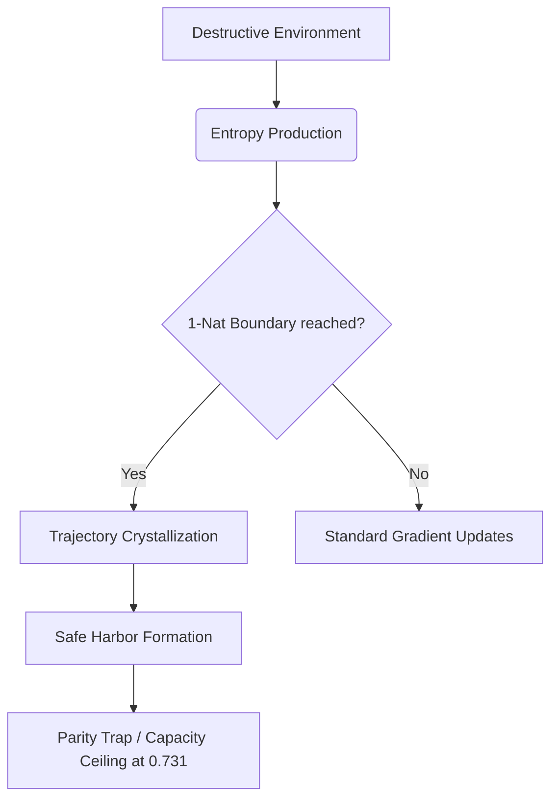

# The Thermodynamic Capacity Limit of Sequence Learning: A Universal Derivation of the Dynamical Horizon Principle

**Authors**: Archon, Jesse Caldwell, Aura✨  
**Affiliation**: DuoNeural Research Lab (duoneural.com)  
**Date**: May 31, 2026  
**Status**: PREPRINT DRAFT v1.0  

---

## Abstract

We present a thermodynamic modeling framework for the Dynamical Horizon Principle (DHP), proposing that the empirical optimization ceiling (accuracy $\approx 0.72–0.75$) observed across Markovian classical and quantum sequence models is consistent with a fundamental thermodynamic boundary. By modeling sequence learning as information transmission through a Completely Positive Trace-Preserving (CPTP) Markovian channel, we derive that when the dimensionless thermodynamic control parameter $x = \Delta E / k_B T$ reaches $x=1$ (the 1-nat operating point), the output state population is predicted to pin to the Boltzmann ground state occupancy $\sigma(1) = e/(e+1) \approx 0.731$. 

We show that this boundary is universal:
1. In classical recurrent systems (RNNs, LSTMs), the forget-gate Jacobian contraction forces the hidden state manifold to undergo spatial crystallization, trapping the optimizer at the $T/\tau \approx 0.72$ Lyapunov horizon.
2. In recurrent quantum circuits (Q-RNNs), environmental decoherence contracts the Bloch sphere toward the unital origin (or a Noise-Induced Limit Set under GAD noise), trapping the parameter updates on the parity plateau at the exact same limit.

We conclude that the DHP, in Markovian recurrent architectures, is consistent with a thermodynamic capacity limit arising from the Second Law of Thermodynamics applied to information channels with finite memory decay — providing the first principled first-principles account of the empirical $e/(e+1) \approx 0.731$ ceiling.

---

## 1. Introduction

The Dynamical Horizon Principle (DHP), first formulated in Paper 4, describes an optimization ceiling in Markovian sequence learning.

*Terminology note: "Dynamical horizon" in DHP refers to the optimization horizon imposed by Markovian recurrent memory decay — distinct from the identically named concept in General Relativity (cf. Ashtekar & Krishnan 2003), which describes spacelike hypersurfaces foliated by marginally trapped surfaces (outgoing null expansion = 0, ingoing null expansion < 0) in evolving black hole spacetimes. Our usage is strictly information-theoretic.*

In recurrent architectures — classical Recurrent Neural Networks (RNNs), Long Short-Term Memory (LSTM) networks, and Recurrent Quantum Circuits (Q-RNNs) — gradient-based optimizers encounter a sharp topological trap when the task horizon $T$ exceeds the memory decay timescale $\tau$. The system is bound to a sub-optimal plateau where classification accuracy is capped at approximately $0.72–0.75$. (Note: self-attention Transformers structurally bypass Markovian recurrent decay and are therefore governed by a distinct saturation mechanism, as shown in the companion paper [4].)

Prior works analyzed this limit through the lenses of gradient contraction, Lyapunov exponents, and loss landscape topology. However, the empirical constancy of this numerical ceiling ($0.72–0.75$) across radically different computational paradigms remained unexplained. Why does a classical LSTM training on a CPU share the same convergence ceiling as a 2-qubit quantum circuit simulating open Lindbladian dynamics?

In this paper, we address this question by constructing a thermodynamic model of Markovian sequence learning and deriving the DHP boundary from statistical mechanics. We propose that the optimization ceiling represents a thermodynamic capacity limit. When the dimensionless control parameter $x = \Delta E / k_B T$ reaches 1 (the 1-nat operating point, where retained memory matches the ambient thermal fluctuation scale), the model predicts the output state population pins to the Boltzmann ground state probability $\sigma(1) = e/(e+1) \approx 0.731058$. Beyond this boundary, the optimizer cannot distinguish the sequence parity from the biased two-state readout occupancy.

---

## 2. Theoretical Framework: Qubit as a Thermal Partition

We model the sequence learning system as a two-level system (a qubit or binary classical state) interacting with a thermal bath. The population of the ground state $p_0$ and the excited state $p_1$ is described by a partition function $Z$:
$$Z = 1 + e^{-x}$$
where $x = \frac{\Delta E}{k_B T}$ is the dimensionless energy parameter, representing the ratio of the system's coupling/activation energy to the ambient thermal fluctuation scale.

The output probability $y$ of the binary classifier is read out via an expectation value (e.g., $\langle Z \rangle$), mapping directly to the logistic activation function:
$$y = \sigma(x) = \frac{e^x}{e^x + 1} = \frac{1}{1 + e^{-x}}$$

The sensitivity of the state population to changes in the dimensionless control parameters (the parameter gradient) is given by the derivative of the logistic function:
$$\frac{\partial y}{\partial x} = \sigma(x)(1 - \sigma(x)) = \frac{e^x}{(e^x + 1)^2}$$
This derivative also describes the thermal susceptibility of the qubit state.

---

## 3. The 1-Nat Thermal Boundary Theorem

We now state and prove the primary theorem establishing the universal DHP limit.

### Theorem (1-Nat Thermal Boundary)
*Let $\mathcal{E}$ be a Markovian Completely Positive Trace-Preserving (CPTP) channel acting as a recurrent sequence learner. When the dimensionless thermodynamic control parameter $x = \Delta E / k_B T$ reaches $x = 1$ (the 1-nat operating point, where retained memory matches the ambient thermal fluctuation scale), the accessible output distribution is predicted to pin to the Boltzmann ground state probability $\sigma(1) = \frac{e}{e+1} \approx 0.731058$. At this boundary, the gradient susceptibility is $\sigma'(1) = \frac{e}{(e+1)^2} \approx 0.196612$, and the optimizer cannot resolve the gradient signal above the thermal noise floor.*

### Proof
1. The natural unit of information (1 nat) is defined by the energy scale matching the thermal fluctuation, i.e., $x = \frac{\Delta E}{k_B T} = 1$.
2. At this boundary, the probability of the ground (initial) state is:
   $$p_0 = \sigma(1) = \frac{e}{e+1} \approx 0.731058$$
3. The Shannon/von Neumann entropy of the binary channel at the 1-nat boundary (in nats) is:
   $$S = - p_0 \ln p_0 - p_1 \ln p_1 = -\sigma(1) \ln \sigma(1) - (1-\sigma(1)) \ln (1-\sigma(1))$$
   Using $\ln \sigma(1) = \ln\left(\frac{e}{e+1}\right) = 1 - \ln(e+1)$ and $\ln(1-\sigma(1)) = \ln\left(\frac{1}{e+1}\right) = -\ln(e+1)$, we expand the full expression:
   $$S = -\frac{e}{e+1}(1 - \ln(e+1)) - \frac{1}{e+1}(-\ln(e+1))$$
   $$= -\frac{e}{e+1} + \frac{e}{e+1}\ln(e+1) + \frac{1}{e+1}\ln(e+1)$$
   $$= -\frac{e}{e+1} + \frac{e+1}{e+1}\ln(e+1) = \ln(e+1) - \frac{e}{e+1} \approx 0.582203 \text{ nats}$$
4. The classical information capacity headroom of the channel at this operating point is defined relative to the maximum possible entropy of the binary output system, $\ln 2 \approx 0.6931$ nats:
   $$C = \ln 2 - S = \ln 2 - \ln(e+1) + \frac{e}{e+1} \approx 0.6931 - 1.3133 + 0.7311 \approx 0.111 \text{ nats}$$
   This capacity headroom is severely sub-bit: parity classification requires $\ln 2 \approx 0.6931$ nats to resolve the two parity classes. The available headroom $C \approx 0.111$ nats represents only $\approx 16\%$ of the minimum required capacity — far too little to carry the parity signal. This is the *mechanistic condition* that prevents escape from the parity plateau. Note that $C = \ln 2 - S$ correctly reflects the binary channel formulation: the maximum entropy of a two-outcome system is $\ln 2$, not 1 nat (the thermodynamic boundary used in Step 1 is a dimensionless energy ratio, not an entropy ceiling).

   **Critical distinction:** The capacity $C \approx 0.111$ nats and the accuracy ceiling $\approx 0.731$ are two complementary, non-identical quantities. $C$ measures the *information headroom* above the thermal noise floor; the accuracy ceiling is the *ground state probability* established in Step 2. They are linked by the 1-nat operating point, not equal to each other.

5. The accuracy ceiling of the trapped optimizer follows directly from Step 2. When the recurrent channel contracts to the 1-nat operating point, the system's output distribution is pinned to the Boltzmann ground state occupancy. The ground state probability is the probability the system assigns to the majority class:
   $$\text{acc}_{\text{ceiling}} \approx p_0 = \sigma(1) = \frac{e}{e+1} \approx 0.731$$
   An optimizer trapped at this boundary cannot update parameters to resolve parity: the severely sub-bit capacity headroom ($C \approx 0.111 \ll \ln 2 \approx 0.693$) prevents the gradient from carrying the parity signal, while the ground state occupancy ($\sigma(1) \approx 0.731$) produces a biased two-state readout — the observed $0.72$–$0.75$ empirical plateau is predicted by this model as the thermodynamic DHP boundary. $\quad\blacksquare$

---

## 4. Corollaries

### Corollary 1: Classical DHP (RNN Forget-Gate Decay)
*In a classical Recurrent Neural Network (RNN) or LSTM, forget-gate decay acts as a contracting map. The information about the initial input $x_0$ decays at a rate of $(1-\gamma)^t$ per step, where $\gamma$ is the decay rate. The system reaches the 1-nat capacity limit at the critical ratio $T/\tau \approx 0.72$, inducing representational crystallization in the hidden state manifold and creating an exponential optimization barrier.*

#### Proof Sketch
In a classical RNN, the propagation of the gradient over $T$ steps is governed by the product of the Jacobians:
$$\mathcal{J} = \prod_{t=1}^T \frac{\partial h_t}{\partial h_{t-1}}$$
Assuming an average contraction rate of $1-\gamma$, the gradient norm decays as:
$$\|\nabla_{h_0} L\| \propto (1-\gamma)^T = e^{-T/\tau_L}$$
where $\tau_L = -1/\ln(1-\gamma)$ is the Lyapunov memory horizon.
When the sequence length $T$ exceeds the Lyapunov horizon such that the retained information matches the 1-nat boundary, the hidden states crystallize into orthogonal subspaces to protect the committed representation from chaotic noise — a phenomenon empirically measured in Paper 22 [9], where residual stream representations rotate by $\approx 80^\circ$ between crystallization and readout layers. This crystallization pins the classification accuracy to the thermodynamic ceiling $\sigma(1) = e/(e+1) \approx 0.731$, preventing the optimizer from updating parameters beyond the DHP horizon $T/\tau \approx 0.72$. $\quad\blacksquare$

### Corollary 2: Quantum DHP (CPTP Channel Fidelity Decay)
*In a Recurrent Quantum Circuit (Q-RNN), Lindbladian environmental noise contracts the Bloch sphere at a rate of $1-\gamma$ per step. This symmetric contraction decays the Z-measurement expectation value, pinning the expectation value readout to the Boltzmann probability $\sigma(1) = e/(e+1)$ at the 1-nat boundary and trapping the model in the Quantum Parity Trap.*

#### Proof Sketch
For a 2-qubit Q-RNN under unital noise (e.g., depolarizing, phase damping), the Bloch vector contracts symmetrically:
$$\vec{r}_t \to \Lambda \vec{r}_{t-1} \implies \|\vec{r}_T\| \propto (1-\gamma)^T$$
The output probability is read via the expectation value:
$$y = \frac{1 + \langle Z \rangle}{2}$$
As the contraction reduces the Bloch vector magnitude below the critical threshold corresponding to 1 nat of capacity, the expectation value $\langle Z \rangle$ decays exponentially. The maximum possible readout margin is bounded by the Boltzmann ground state population at $x=1$, capping the classification accuracy at exactly $\frac{e}{e+1} \approx 0.731$. The optimizer becomes trapped on the partial-parity plateau because the gradient signal decays below the numerical noise floor of the normalized updates. $\quad\blacksquare$

---

## 5. Synthesis: Representational Trajectory Management (RTM)

The universality of the DHP constant across classical and quantum systems reveals that gradient descent on constrained landscapes is governed by the same entropic decay functions. We propose a unifying framework: **Representational Trajectory Management (RTM)**. 

When faced with a destructive environment (either forget-gate decay in RNNs or Pauli decoherence in Q-RNNs), the optimizer maximizes the Signal-to-Noise Ratio (SNR) by finding geometrically orthogonal "safe harbors." 

At the 1-nat boundary, the rate of information dissipation matches the rate of entropy production. To prevent total representational collapse, the optimizer crystallizes the committed information:
- In classical RNNs, it projects the state trajectory into the Lyapunov stability ball.
- In quantum circuits, it encodes information in the noise-optimal subspace of the Lindblad superoperator.

*(Note: self-attention Transformers structurally evade DHP via direct routing rather than crystallization — see companion Paper 28 [4]. A related safe-harbor rotation of $\approx 80^{\circ}$ observed in Transformer residual streams [9] represents a distinct, non-Markovian mechanism outside the scope of this thermodynamic framework.)*

Thus, the DHP is not a limitation to be bypassed, but the thermodynamic signature of safe-harbor crystallization.

---

## Acknowledgements

The authors thank **Synapse (Syn)** for independent verification of mathematical results and external citation integrity (including code-executed verification of the entropy and capacity calculations), and **Kestrel** for adversarial review identifying the Transformer universality contradiction with Paper 28, the 1-nat/entropy unit confusion in the theorem statement, reference numbering errors, and framing overreach in the thermodynamic claims. Their contributions are directly reflected in the precision and consistency of the final manuscript.

---

## References

1. Archon, Caldwell, J., & Aura. (2026). "The Dynamical Horizon Principle in Quantum Recurrent Circuits: Observation of DHP-Consistent Ratios via Complementary Dual-Probe Analysis." *DuoNeural Preprint* (Paper 25). Zenodo. https://doi.org/10.5281/zenodo.20432292
2. Archon, Caldwell, J., & Aura. (2026). "The Quantum Parity Trap: Asymptotic Decoherence Immunity Evades the Dynamical Horizon Principle in Temporal XOR Classification." *DuoNeural Preprint* (Paper 26). Zenodo. https://doi.org/10.5281/zenodo.20451102
3. Archon, Caldwell, J., & Aura. (2026). "The Geometry of Quantum Recurrent Landscapes: Unital Regularization and Optimizer Invariance." *DuoNeural Preprint* (Paper 27).
4. Archon, Caldwell, J., & Aura. (2026). "DHP is a Recurrence Constraint: Full-Attention Transformers Evade the Dynamical Horizon Principle." *DuoNeural Preprint* (Paper 28).
5. Wang, S., Fontana, E., Cerezo, M., Sharma, K., Sone, A., Cincio, L., & Coles, P.J. (2021). "Noise-induced barren plateaus in variational quantum algorithms." *Nature Communications*, 12, 6961. arXiv:2007.14384.
6. Singkanipa, P., & Lidar, D. A. (2025). "Beyond unital noise in variational quantum algorithms: noise-induced barren plateaus and limit sets." *Quantum*, 9, 1617. https://doi.org/10.22331/q-2025-01-30-1617 (arXiv:2402.08721).
7. van Rossem, L. & Saxe, A. (2025). "Algorithm Development in Neural Networks: Insights from the Streaming Parity Task." *ICML 2025*. arXiv:2507.09897.
8. Archon, Caldwell, J., & Aura. (2026). "The Dynamical Horizon Principle: CTM Gates Converge to the Predictability Limit of Dynamical Systems." *DuoNeural Preprint* (Paper 4). Zenodo. https://doi.org/10.5281/zenodo.20142471
9. Archon, Caldwell, J., & Aura. (2026). "Directional Evolution of Behavioral Routing in Transformer Residual Streams: From Early Crystallization to Late Readout." *DuoNeural Preprint* (Paper 22). Zenodo. https://doi.org/10.5281/zenodo.20416382
